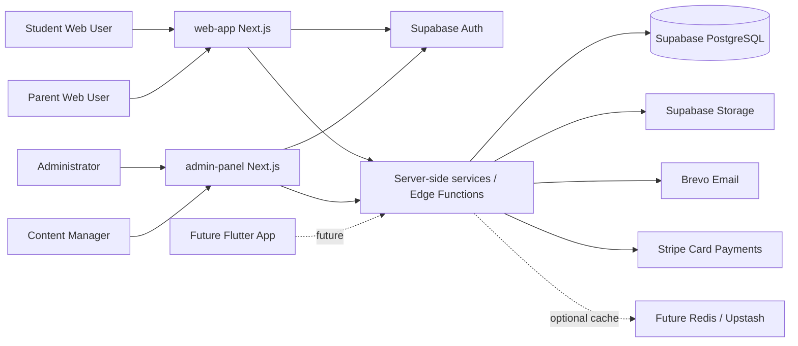
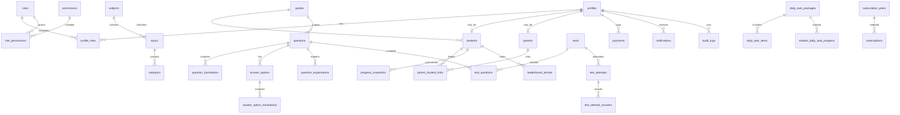

# 02 Architecture, Database and Backend


## Repository Placement and Related Files

- Intended path: `docs/master/02_ARCHITECTURE_DATABASE_AND_BACKEND.md`
- Folder: `docs/master/`
- Primary readers: Software architect, database architect, backend engineer, Supabase implementer, Claude Code
- Related master docs: `docs/master/00_MASTER_PROJECT_BLUEPRINT.md`, `docs/master/01_REQUIREMENTS_AND_SCOPE_MAPPING.md`, `docs/master/03_AUTH_RBAC_SECURITY_AND_AUDIT.md`
- Scope controlled by this file: Technical architecture, backend boundaries, proposed PostgreSQL schema and SQL planning
- Source-of-truth level: Master source of truth for backend/database architecture


## Approved Root Project Structure


```text
olimpiada-portal/
│
├── docs/
│   ├── master/
│   │   ├── 00_MASTER_PROJECT_BLUEPRINT.md
│   │   ├── 01_REQUIREMENTS_AND_SCOPE_MAPPING.md
│   │   ├── 02_ARCHITECTURE_DATABASE_AND_BACKEND.md
│   │   ├── 03_AUTH_RBAC_SECURITY_AND_AUDIT.md
│   │   ├── 04_WEB_APP_PLAN_STUDENT_PARENT.md
│   │   ├── 05_ADMIN_PANEL_AND_CONTENT_MANAGEMENT.md
│   │   ├── 06_CORE_MODULES_PAYMENTS_LEADERBOARD_NOTIFICATIONS_ANALYTICS.md
│   │   └── 07_ROADMAP_TESTING_DEVOPS_AND_AI_AGENT_RULES.md
│   │
│   └── decisions/
│       └── future architecture decisions, scope confirmations, investor/client decisions
│
├── supabase/
│   ├── markdowns/
│   │   ├── SUPABASE_IMPLEMENTATION_CONTEXT.md
│   │   ├── SUPABASE_SCHEMA_SECURITY_PLAN.md
│   │   └── SUPABASE_SQL_RUN_ORDER.md
│   │
│   ├── sql/
│   │   ├── 001_extensions_and_enums.sql
│   │   ├── 002_core_profiles_roles_permissions.sql
│   │   ├── 003_academic_taxonomy.sql
│   │   ├── 004_content_questions_tests.sql
│   │   ├── 005_attempts_daily_tasks_progress.sql
│   │   ├── 006_leaderboards_analytics.sql
│   │   ├── 007_subscriptions_payments_coupons.sql
│   │   ├── 008_notifications_support_audit.sql
│   │   ├── 009_storage_buckets_policies.sql
│   │   ├── 010_rls_policies.sql
│   │   ├── 011_indexes_constraints_functions_triggers.sql
│   │   ├── 012_seed_initial_data.sql
│   │   └── 013_validation_queries.sql
│   │
│   └── README_RUN_ORDER.md
│
├── web-app/
│   ├── markdowns/
│   │   ├── WEB_APP_IMPLEMENTATION_CONTEXT.md
│   │   ├── WEB_APP_ROUTES_AND_COMPONENTS.md
│   │   ├── WEB_APP_BACKEND_CONTRACT.md
│   │   └── WEB_APP_CLAUDE_CODE_RULES.md
│   │
│   └── actual Next.js Web App files will be created later
│
├── admin-panel/
│   ├── markdowns/
│   │   ├── ADMIN_PANEL_IMPLEMENTATION_CONTEXT.md
│   │   ├── ADMIN_PANEL_ROUTES_AND_MODULES.md
│   │   ├── ADMIN_PANEL_RBAC_AND_SECURITY.md
│   │   ├── ADMIN_PANEL_CONTENT_MANAGEMENT.md
│   │   └── ADMIN_PANEL_CLAUDE_CODE_RULES.md
│   │
│   └── actual Next.js Admin Panel files will be created later
│
└── mobile-app/
    ├── markdowns/
    │   └── FUTURE_MOBILE_READINESS.md
    │
    └── future Flutter app files will be created later
```


## Overall Architecture



## Separate Next.js Applications

`web-app/` is the Student/Parent Web App. `admin-panel/` is the Administrator/Content Manager Admin Panel. They must not share pages, routes or UI-specific business rules. Shared domain contracts should be duplicated carefully as typed service contracts or later extracted into a shared package only if the repo structure supports it.

## Shared Supabase Backend

The root-level `supabase/` folder belongs to the whole platform, not to either app. It contains SQL planning, migrations, RLS policies, storage bucket policies and backend context. Both Next.js apps use the same Supabase project, Auth, PostgreSQL database, Storage, payment tables, roles, permissions and audit logs.

## Backend/API Strategy

Use a balanced model:

- Supabase Auth for authentication.
- PostgreSQL with RLS for data security.
- Supabase Edge Functions for payment webhooks, leaderboard recalculation, notification dispatch, scheduled summaries and privileged operations.
- Next.js server-side services/actions for app-specific orchestration when they do not require service role access.
- Client-side Supabase access only for safe, RLS-protected reads/writes.

## Service-Layer Boundaries

| Service | Main responsibility | Must not do |
|---|---|---|
| `AuthService` | Session, profile onboarding, role lookup | Trust client role claims without database verification |
| `ContentService` | Questions, options, explanations, review workflow | Expose correct answers before result flow |
| `TestService` | Test attempt lifecycle, grading, result generation | Let client calculate authoritative score |
| `DailyTaskService` | Package retrieval, completion tracking | Allow duplicate completions |
| `ProgressService` | Snapshots, weak/strong topics | Run expensive raw queries on every page load |
| `LeaderboardService` | Ranking calculation and retrieval | Make Redis required for correctness |
| `SubscriptionService` | Plan access, subscription state | Trust client payment success |
| `PaymentService` | Stripe checkout/webhooks/idempotency | Expose secret keys to client |
| `NotificationService` | In-app/email dispatch | Send SMS |
| `AuditService` | Immutable sensitive action logging | Allow update/delete from UI |

## Environment Strategy

| Environment | Purpose | Rules |
|---|---|---|
| Local | Developer work | Local `.env`, never production keys, local/staging Supabase only. |
| Staging | QA and client review | Separate Supabase project or schema, Stripe test mode, seeded test data. |
| Production | Real users and payments | Strict secrets, RLS enabled, backups, monitoring, manual migration approval. |

## File/Media Storage Strategy

Do **not** store binary files inside PostgreSQL tables. PostgreSQL should store only metadata: bucket name, object path, MIME type, file size, owner, access level, created date and moderation status. Actual files must live in object storage.

For the current MVP, Supabase Storage is acceptable and should contain only lightweight educational/media assets such as:

- `question-media`: optimized images and small audio files for questions, especially English listening tasks.
- `explanation-media`: optimized images/audio attached to explanations when needed.
- `profile-avatars`: optional resized avatars.
- `admin-imports`: temporary content import files, if bulk import is later used.
- `reports`: generated CSV/PDF exports only if report export is implemented later; PDFs are not a core learning-content storage requirement.

Images must be resized/compressed before or during upload. Audio must use size/duration limits. Video lessons and large media libraries are future-only and must not be stored in the MVP content system.

Storage policies must prevent public write access. Published question media can be publicly readable if not sensitive; private reports/imports must require signed URLs and ownership checks. If media egress becomes a proven cost issue later, add a `StorageProvider` abstraction and move high-traffic public assets to another object-storage/CDN provider without changing database ownership rules.

## Multilingual Data Model

Use translation tables for content:

- Core `questions` table stores language-neutral metadata.
- `question_translations`, `answer_option_translations`, `question_explanations` store `locale` variants.
- MVP locale is `az`.
- `ru` and `en` are future content phases.

UI strings should be i18n-ready in both apps, but only Azerbaijani must be complete for MVP.

## Future Mobile Compatibility

Future Flutter app must use the same backend contracts:

- Same Supabase Auth sessions.
- Same API/Edge Functions.
- Same RLS ownership rules.
- Same subscription and notification data.
- Future push token table can be added under notifications without rewriting current notification model.

No current mobile screens or Flutter app implementation should be planned here.

## Future Redis Compatibility

PostgreSQL remains source of truth. Redis, if later added, may cache:

- Leaderboard top pages.
- Frequently requested progress summaries.
- Rate limit counters.
- Temporary recalculation locks.

Redis must not store unnecessary PII and must have fallback to PostgreSQL.

## Future School/Partner Compatibility

Add `schools`, `districts`, optional `student_school_memberships`, and scope fields in leaderboard entries. Do not implement partner dashboard now.

## Proposed Database Schema


| Table | Purpose | Key columns | Relationships | Indexes/constraints | RLS | Audit | SQL file |
|---|---|---|---|---|---|---|---|
| `profiles` | Public application profile linked to Supabase Auth | `id`, `auth_user_id`, `display_name`, `email`, `phone_optional`, `preferred_locale`, `status` | 1:1 auth user; many roles | unique `auth_user_id`, email where needed | Own profile; admin full | status changes | 002 |
| `roles` | Role definitions | `id`, `code`, `name`, `is_system` | role_permissions | unique code | read for authenticated; admin write | role creation/update | 002 |
| `permissions` | Atomic permissions | `id`, `code`, `description` | role_permissions | unique code | admin write | permission changes | 002 |
| `role_permissions` | Role-permission join | `role_id`, `permission_id` | roles, permissions | composite unique | admin only | always | 002 |
| `profile_roles` | User role assignments | `profile_id`, `role_id`, `assigned_by` | profiles, roles | composite unique | admin only | always | 002 |
| `students` | Student-specific data | `profile_id`, `grade_id`, `school_id`, `district_id`, `birth_year_optional` | profiles, grades, schools | unique profile | student self read; parent linked; admin | profile changes | 002/003 |
| `parents` | Parent-specific data | `profile_id` | profiles | unique profile | self/admin | profile changes | 002 |
| `parent_student_links` | Verified parent-child relationship | `parent_profile_id`, `student_profile_id`, `status`, `verified_at` | parents, students | unique active pair | parent linked, student own, admin | link/unlink | 002 |
| `schools` | Future-ready school reference | `id`, `name`, `district_id`, `status` | districts, students | indexes district/name | admin write; public limited | changes | 003 |
| `districts` | Rayon/district reference | `id`, `name`, `country_code` | schools | unique country/name | read auth; admin write | changes | 003 |
| `grades` | Grade 1-11 | `id`, `level`, `name` | students, tests | unique level | read public/auth; admin write | changes | 003 |
| `subjects` | Subject catalog | `id`, `code`, `name`, `status` | topics, tests | unique code | read active; admin write | changes | 003 |
| `topics` | Subject/grade topics | `id`, `subject_id`, `grade_id`, `name`, `order_index` | subjects, grades, subtopics | indexed subject/grade | read active; admin/content write | changes | 003 |
| `subtopics` | Nested topic detail | `id`, `topic_id`, `name`, `order_index` | topics, questions | indexed topic | read active; admin/content write | changes | 003 |
| `question_types` | Config question type catalog | `id`, `code`, `supports_auto_grading` | questions | unique code | read; admin write | changes | 004 |
| `difficulty_levels` | Difficulty catalog | `id`, `code`, `weight` | questions | unique code | read; admin write | changes | 004 |
| `olympiad_types` | Local/international type catalog | `id`, `code`, `name` | questions/tests | unique code | read; admin write | changes | 004 |
| `sources` | Question source metadata | `id`, `name`, `license_notes` | questions | unique optional | admin/content | changes | 004 |
| `questions` | Core question entity | `id`, `grade_id`, `subject_id`, `topic_id`, `subtopic_id`, `type_id`, `difficulty_id`, `status`, `created_by` | taxonomy, translations/options/explanations | indexes taxonomy/status | published read by subscribed students; draft owner/admin | create/edit/archive | 004 |
| `question_translations` | Language-specific question body | `question_id`, `locale`, `body`, `prompt`, `media_asset_id` | questions/media | unique question+locale | same as question | content changes | 004 |
| `answer_options` | Options for objective questions | `id`, `question_id`, `is_correct`, `order_index` | questions, translations | index question | hidden correctness to students before result | changes | 004 |
| `answer_option_translations` | Localized answer option text | `option_id`, `locale`, `text` | answer_options | unique option+locale | same as option | changes | 004 |
| `question_explanations` | Solution/explanation text/media | `question_id`, `locale`, `explanation_body` | questions | unique question+locale | visible after attempt/result | changes | 004 |
| `tests` | Test packages | `id`, `grade_id`, `subject_id`, `title`, `status`, `duration_seconds`, `scoring_policy` | test_questions, attempts | indexes grade/subject/status | published read; admin/content manage | create/edit/publish | 004 |
| `test_questions` | Questions included in test | `test_id`, `question_id`, `order_index`, `points` | tests/questions | unique test+question | same as test | changes | 004 |
| `test_attempts` | Student test attempt | `id`, `test_id`, `student_profile_id`, `started_at`, `submitted_at`, `score`, `status` | tests/students/answers | index student/test/status | student own, parent linked, admin | suspicious/regrade | 005 |
| `test_attempt_answers` | Answers in attempt | `attempt_id`, `question_id`, `selected_option_ids`, `answer_text`, `is_correct`, `time_spent_ms` | attempt/questions | unique attempt+question | attempt owner/linked parent/admin | changes/regrade | 005 |
| `daily_task_packages` | Scheduled task package | `id`, `grade_id`, `subject_id`, `publish_date`, `status` | items/progress | unique grade/subject/date maybe | published read; admin/content manage | create/publish | 005 |
| `daily_task_items` | Questions in task package | `package_id`, `question_id`, `order_index`, `points` | packages/questions | unique package+question | same as package | changes | 005 |
| `student_daily_task_progress` | Student task state/result | `student_profile_id`, `package_id`, `status`, `score`, `completed_at` | students/packages | unique student+package | student own, parent linked, admin | changes | 005 |
| `progress_snapshots` | Aggregated progress metrics | `student_profile_id`, `period`, `subject_id`, `topic_id`, `metrics_json` | students/subjects/topics | index student/period | student own, parent linked, admin | generated | 005/006 |
| `leaderboard_periods` | Ranking periods | `id`, `period_type`, `starts_at`, `ends_at` | entries/snapshots | unique period | read; admin write | recalc | 006 |
| `leaderboard_entries` | Rank rows | `period_id`, `student_profile_id`, `scope_type`, `scope_id`, `points`, `rank` | periods/students | unique period+student+scope | public limited pseudonym; own detail | recalc/review | 006 |
| `leaderboard_snapshots` | Stored leaderboard versions | `id`, `period_id`, `scope`, `generated_at`, `metadata` | entries | index generated | admin/read published | recalc | 006 |
| `achievements` | Badge/certificate readiness | `id`, `code`, `name`, `criteria_json` | student_achievements | unique code | read active; admin write | changes | 006 |
| `student_achievements` | Earned achievements | `student_profile_id`, `achievement_id`, `earned_at` | students/achievements | unique pair | own, parent linked, admin | award/revoke | 006 |
| `subscription_plans` | Weekly/monthly/yearly plans | `id`, `code`, `price`, `interval`, `status`, `stripe_price_id` | subscriptions | unique code | public active; admin write | changes | 007 |
| `subscriptions` | User subscription state | `id`, `owner_profile_id`, `student_profile_id`, `plan_id`, `status`, `current_period_end` | plans/profiles | index owner/student/status | owner, linked student read, admin | status changes | 007 |
| `payments` | Payment records | `id`, `provider`, `profile_id`, `amount`, `currency`, `status`, `provider_ref` | subscriptions/events | unique provider_ref | owner limited, admin | status changes | 007 |
| `payment_events` | Webhook/idempotency log | `id`, `provider`, `event_id`, `payload_json`, `processed_at` | payments | unique provider+event | admin/service only | always | 007 |
| `coupons` | Promo code setup | `id`, `code`, `discount_type`, `value`, `status` | redemptions | unique code | admin only; redeem service | create/update | 007 |
| `coupon_redemptions` | Coupon usage | `coupon_id`, `profile_id`, `payment_id`, `redeemed_at` | coupons/payments | unique rules | owner/admin | usage | 007 |
| `notifications` | In-app notifications | `id`, `recipient_profile_id`, `type`, `title`, `body`, `read_at` | profiles/templates | index recipient/read | recipient own; admin send | send/read | 008 |
| `notification_templates` | Email/in-app templates | `id`, `code`, `locale`, `subject`, `body` | deliveries | unique code+locale | admin only | changes | 008 |
| `notification_deliveries` | Email delivery state | `id`, `notification_id`, `channel`, `status`, `provider_ref` | notifications | index status | recipient limited/admin | delivery | 008 |
| `support_requests` | Support/contact tickets | `id`, `profile_id`, `category`, `status`, `message` | profiles | index profile/status | owner/admin/support | changes | 008 |
| `audit_logs` | Immutable audit trail | `id`, `actor_profile_id`, `action`, `target_table`, `target_id`, `before_json`, `after_json`, `ip`, `user_agent`, `severity`, `success` | profiles | append-only indexes action/time | admin only; no updates | itself append-only | 008 |
| `admin_actions` | Structured admin action tracking | `id`, `audit_log_id`, `action_type`, `review_status` | audit_logs | index type | admin only | always | 008 |
| `content_reviews` | Review workflow | `id`, `content_type`, `content_id`, `status`, `reviewer_id`, `comments` | questions/tests/tasks | index status | content owner/admin/reviewer | review | 008/004 |
| `media_assets` | Uploaded files metadata | `id`, `bucket`, `path`, `owner_profile_id`, `mime_type`, `visibility` | questions/profiles | unique bucket/path | owner/admin/published read | upload/delete | 008/009 |
| `system_settings` | Platform settings | `key`, `value_json`, `updated_by` | none | pk key | admin only | changes | 008 |
| `feature_flags` | Safe rollout flags | `key`, `enabled`, `rules_json` | none | pk key | admin only | changes | 008 |


## ERD Overview



## SQL Script File Structure and Run Order


| Order | File | Main responsibility | Safe to rerun? |
|---:|---|---|---|
| 001 | `supabase/sql/001_extensions_and_enums.sql` | Extensions, enum types, common domains | Mostly yes, with `if not exists` |
| 002 | `supabase/sql/002_core_profiles_roles_permissions.sql` | Profiles, roles, permissions, profile roles | Mostly yes |
| 003 | `supabase/sql/003_academic_taxonomy.sql` | Grades, subjects, topics, subtopics, schools, districts | Mostly yes |
| 004 | `supabase/sql/004_content_questions_tests.sql` | Questions, translations, options, explanations, tests | Mostly yes |
| 005 | `supabase/sql/005_attempts_daily_tasks_progress.sql` | Attempts, answers, daily tasks, progress snapshots | Mostly yes |
| 006 | `supabase/sql/006_leaderboards_analytics.sql` | Leaderboard periods, snapshots, analytics summary tables | Mostly yes |
| 007 | `supabase/sql/007_subscriptions_payments_coupons.sql` | Plans, subscriptions, payments, Stripe events, coupons | Mostly yes |
| 008 | `supabase/sql/008_notifications_support_audit.sql` | Notifications, templates, deliveries, support, audit logs | Mostly yes |
| 009 | `supabase/sql/009_storage_buckets_policies.sql` | Storage buckets and storage policies | Caution; policy conflicts possible |
| 010 | `supabase/sql/010_rls_policies.sql` | All table RLS enablement and policies | Caution; test after every run |
| 011 | `supabase/sql/011_indexes_constraints_functions_triggers.sql` | Indexes, constraints, helper functions, triggers | Mostly yes; validate trigger duplication |
| 012 | `supabase/sql/012_seed_initial_data.sql` | Initial roles, permissions, grades, subjects, settings | Yes if upsert-based |
| 013 | `supabase/sql/013_validation_queries.sql` | Read-only validation queries and smoke checks | Yes; read-only |


## Migration Strategy

- Generate SQL files later under `supabase/sql/` only.
- Run scripts manually or through Supabase CLI in numeric order.
- Use `create table if not exists`, `create index if not exists`, and `insert ... on conflict` where safe.
- Avoid destructive changes in MVP scripts.
- RLS policies belong in `010_rls_policies.sql`, not mixed randomly with table creation.
- Validation queries belong in `013_validation_queries.sql` and must be read-only.

## Error Handling Strategy

- Domain errors should be typed: `UNAUTHORIZED`, `FORBIDDEN`, `NOT_FOUND`, `VALIDATION_ERROR`, `SUBSCRIPTION_REQUIRED`, `PAYMENT_PENDING`, `RATE_LIMITED`, `CONFLICT`.
- Never expose raw database errors to users.
- Log unexpected errors with request ID and user ID where available.

## Logging Strategy

- Application logs: errors, webhook processing, scheduled jobs.
- Audit logs: sensitive admin/business actions.
- Payment event logs: raw provider event ID and processing state.
- Security logs: failed admin access, permission errors, suspicious leaderboard activity.


## Non-Negotiable Project Decisions

1. The current implementation scope is **Web App + Admin Panel + shared Supabase backend** only.
2. The **Mobile App is future-only**. Current work may only include backend/API readiness for future Flutter compatibility.
3. Web App and Admin Panel are separate Next.js applications under `web-app/` and `admin-panel/`.
4. Supabase is shared infrastructure under the root-level `supabase/` folder. SQL files must never be placed inside `web-app/` or `admin-panel/`.
5. Supabase PostgreSQL is the source of truth for content, users, subscriptions, attempts, progress, leaderboard and audit data.
6. Supabase Auth is used for authentication, with role and permission data enforced through PostgreSQL/RLS and server-side checks.
7. SMS is excluded from the current plan. No SMS OTP, no SMS notification channel, no SMS cost assumptions.
8. Payments are **Stripe-first card payments** with a provider abstraction for future local Azerbaijani providers. Optional bank transfer is excluded.
9. Redis is not required for correctness. The MVP should be PostgreSQL-first with a Redis-ready `LeaderboardService` abstraction.
10. UI approval is not a blocker. Build a clean, simple, responsive, accessible, component-ready frontend that can later be restyled.

## Database Versioning and Migration Discipline

The project uses a professional SQL versioning model:

- `supabase/sql/001...013.sql` are canonical consolidated root SQL files. They define the current full database and must be able to recreate a clean environment from zero.
- `supabase/sql/migrations/` stores incremental changes, hotfixes, production patches, RLS fixes, indexes, and later schema changes.
- Every accepted migration must be backported into the relevant canonical root SQL file.
- Supabase Dashboard SQL Editor can be used for development/staging convenience, but repository SQL files are the source of truth.
- Production database changes must be migration-script controlled and validated before and after application.

