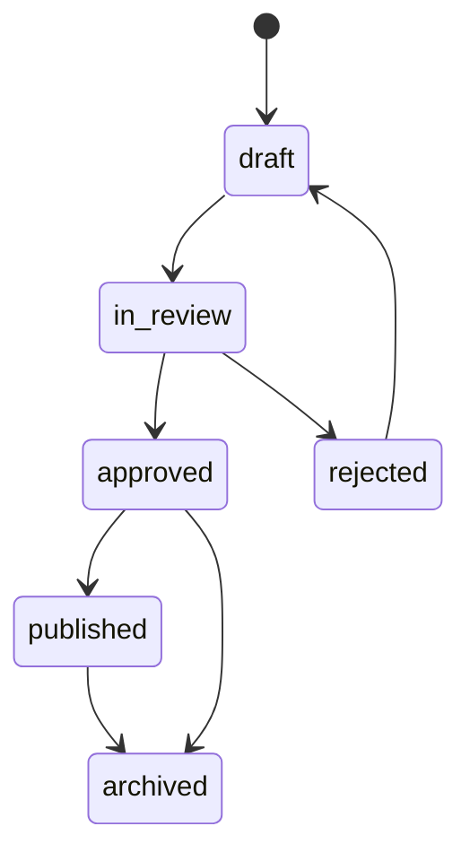

# 05 Admin Panel and Content Management


## Repository Placement and Related Files

- Intended path: `docs/master/05_ADMIN_PANEL_AND_CONTENT_MANAGEMENT.md`
- Folder: `docs/master/`
- Primary readers: Admin Panel developer, backend engineer, content lead, security lead, Claude Code
- Related master docs: `docs/master/00_MASTER_PROJECT_BLUEPRINT.md`, `docs/master/02_ARCHITECTURE_DATABASE_AND_BACKEND.md`, `docs/master/03_AUTH_RBAC_SECURITY_AND_AUDIT.md`
- Scope controlled by this file: Admin Panel modules, Content Manager boundary and content lifecycle
- Source-of-truth level: Master source of truth for Admin Panel and CMS


## Approved Folder Placement

Admin Panel implementation docs belong in `admin-panel/markdowns/`. Actual Next.js Admin Panel files will later be created under `admin-panel/` only.

## Admin Panel Claude Code Sessions Should Read

```text
docs/master/00_MASTER_PROJECT_BLUEPRINT.md
docs/master/02_ARCHITECTURE_DATABASE_AND_BACKEND.md
docs/master/03_AUTH_RBAC_SECURITY_AND_AUDIT.md
docs/master/05_ADMIN_PANEL_AND_CONTENT_MANAGEMENT.md
docs/master/06_CORE_MODULES_PAYMENTS_LEADERBOARD_NOTIFICATIONS_ANALYTICS.md
docs/master/07_ROADMAP_TESTING_DEVOPS_AND_AI_AGENT_RULES.md

admin-panel/markdowns/ADMIN_PANEL_IMPLEMENTATION_CONTEXT.md
admin-panel/markdowns/ADMIN_PANEL_ROUTES_AND_MODULES.md
admin-panel/markdowns/ADMIN_PANEL_RBAC_AND_SECURITY.md
admin-panel/markdowns/ADMIN_PANEL_CONTENT_MANAGEMENT.md
admin-panel/markdowns/ADMIN_PANEL_CLAUDE_CODE_RULES.md
```

## Admin Panel Routing Structure

```text
admin-panel/
└── app/
    ├── login/page.tsx
    ├── dashboard/page.tsx
    ├── users/
    ├── students/
    ├── parents/
    ├── admins/
    ├── content-managers/
    ├── roles-permissions/
    ├── taxonomy/grades/
    ├── taxonomy/subjects/
    ├── taxonomy/topics/
    ├── questions/
    ├── tests/
    ├── daily-tasks/
    ├── reviews/
    ├── leaderboard/
    ├── subscriptions/
    ├── payments/
    ├── coupons/
    ├── notifications/
    ├── reports/
    ├── support/
    ├── audit-logs/
    ├── settings/
    └── feature-flags/
```

## Layout and Sidebar Permissions

The sidebar must be generated from permissions, not hardcoded visibility. Hidden UI is not security; server-side permissions still enforce every action.

## Admin Dashboard

Show: active users, new registrations, content pending review, payment summary, support queue, daily task status, leaderboard suspicious activity, platform warnings.

## Content Manager Limited Dashboard

Show only: assigned drafts, content needing revision, high-error questions for assigned subjects, task/test drafts if permitted, review statuses.

## Admin Module Matrix


| Module | Admin access | Content Manager access | Audit required |
|---|---|---|---|
| User management | Full | No | Yes |
| Student/Parent management | Full | Limited aggregate only | Yes |
| Admin/Content Manager accounts | Full | No | Yes |
| Roles and permissions | Full | No | Yes |
| Grades/subjects/topics | Full | Maybe assigned edit | Yes |
| Questions/options/explanations | Full | Create/edit own drafts/assigned | Yes |
| Question translations | Full | Assigned content only | Yes |
| Tests | Full | If permitted, create drafts | Yes |
| Daily tasks | Full | If permitted, prepare drafts | Yes |
| Content review/approval | Full approve/reject | Submit only, no self-approval | Yes |
| Leaderboard monitoring | Full | No or limited high-error educational stats | Yes for reviews |
| Subscription plans/payments | Full | No | Yes |
| Coupons | Full | No | Yes |
| Notifications | Full | Limited content-related requests if approved | Yes |
| Reports/analytics | Full | Limited subject-level educational analytics | Yes for exports |
| Support requests | Full | No unless assigned | Yes |
| Audit logs | Full read | No | Access audited |
| System settings/feature flags | Full | No | Yes |


## Admin UX Rules

- Data tables support search, filters, sort and pagination.
- Sensitive actions require confirmation dialogs.
- Destructive actions prefer archive/soft-delete.
- Bulk actions require preview and confirmation.
- Exports require permission, reason and audit log.
- Sensitive PII is masked unless necessary.

## Content Lifecycle



| Status | Meaning | Who can move it |
|---|---|---|
| `draft` | Editable unpublished content | Author, Admin |
| `in_review` | Submitted for approval | Content Manager submits; Admin reviews |
| `approved` | Accepted but not necessarily visible | Admin |
| `published` | Visible to student flows | Admin only or authorized publisher |
| `archived` | Hidden but retained | Admin |
| `rejected` | Returned with reason | Admin |

Content Manager cannot approve or publish own content unless explicitly granted later; default is no self-approval.

## Question Type Handling

- Single choice.
- Multiple choice.
- Open answer.
- Numeric answer.
- Matching.
- Ordering.
- Reading comprehension.
- Image-based question.
- Audio-based question for English.
- Video explanation is future-only.

## Validation Rules

- Grade, subject, topic and difficulty required.
- At least one Azerbaijani translation required for MVP publish.
- Objective questions require at least one correct answer.
- Multiple choice can have multiple correct options.
- Explanation recommended for all published questions; required for high-value tests if business decides.
- Media MIME type and size must be validated.
- Duplicate detection should compare body text, normalized answer options and topic.

## Multilingual Content Strategy

- MVP publishes Azerbaijani content.
- Translation tables support `az`, `ru`, `en`.
- Admin Panel shows translation completeness.
- Missing translation falls back to Azerbaijani only where product approves.

## Media Upload Rules

- Use Supabase Storage.
- Draft media limited to author/admin.
- Published question media can be public or signed depending on asset sensitivity.
- Validate file extension, MIME type and size.
- Audit deletes and replacements.

## Content Manager Forbidden Areas

Content Managers cannot access payment management, subscriptions, system settings, roles/permissions, admin account management, full exports, security/audit logs, environment/deployment settings, webhooks, Stripe configuration, feature flags, backup settings or broad destructive actions.

## Prevent Accidental Destructive Actions

- Prefer `archived` over delete.
- Require typed confirmation for irreversible operations.
- Show affected records count before bulk actions.
- Disallow delete if content has attempts unless archived.

## Sensitive Admin Data Display

- Mask emails/phone where full value is not needed.
- Do not expose payment provider payload to non-admins.
- Export only columns necessary for stated reason.

## Derived Admin Files

- `admin-panel/markdowns/ADMIN_PANEL_IMPLEMENTATION_CONTEXT.md`
- `admin-panel/markdowns/ADMIN_PANEL_ROUTES_AND_MODULES.md`
- `admin-panel/markdowns/ADMIN_PANEL_RBAC_AND_SECURITY.md`
- `admin-panel/markdowns/ADMIN_PANEL_CONTENT_MANAGEMENT.md`
- `admin-panel/markdowns/ADMIN_PANEL_CLAUDE_CODE_RULES.md`


## Non-Negotiable Project Decisions

1. The current implementation scope is **Web App + Admin Panel + shared Supabase backend** only.
2. The **Mobile App is future-only**. Current work may only include backend/API readiness for future Flutter compatibility.
3. Web App and Admin Panel are separate Next.js applications under `web-app/` and `admin-panel/`.
4. Supabase is shared infrastructure under the root-level `supabase/` folder. SQL files must never be placed inside `web-app/` or `admin-panel/`.
5. Supabase PostgreSQL is the source of truth for content, users, subscriptions, attempts, progress, leaderboard and audit data.
6. Supabase Auth is used for authentication, with role and permission data enforced through PostgreSQL/RLS and server-side checks.
7. SMS is excluded from the current plan. No SMS OTP, no SMS notification channel, no SMS cost assumptions.
8. Payments are **Stripe-first card payments** with a provider abstraction for future local Azerbaijani providers. Optional bank transfer is excluded.
9. Redis is not required for correctness. The MVP should be PostgreSQL-first with a Redis-ready `LeaderboardService` abstraction.
10. UI approval is not a blocker. Build a clean, simple, responsive, accessible, component-ready frontend that can later be restyled.
