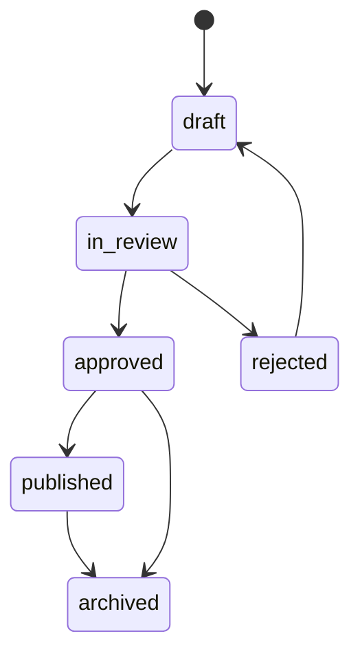

# 05 Admin Panel and Content Management


## Repository Placement and Related Files

- Intended path: `docs/master/05_ADMIN_PANEL_AND_CONTENT_MANAGEMENT.md`
- Folder: `docs/master/`
- Primary readers: Admin Panel developer, backend engineer, content lead, security lead, Claude Code
- Related master docs: `docs/master/00_MASTER_PROJECT_BLUEPRINT.md`, `docs/master/02_ARCHITECTURE_DATABASE_AND_BACKEND.md`, `docs/master/03_AUTH_RBAC_SECURITY_AND_AUDIT.md`
- Scope controlled by this file: Admin Panel modules, Content Manager boundary and content lifecycle
- Source-of-truth level: Master source of truth for Admin Panel and CMS


## Approved Folder Placement

Admin Panel implementation docs belong in `admin-panel/markdowns/`. Actual Next.js Admin Panel files will later be created under `admin-panel/` only.

## Admin Panel Claude Code Sessions Should Read

```text
docs/master/00_MASTER_PROJECT_BLUEPRINT.md
docs/master/02_ARCHITECTURE_DATABASE_AND_BACKEND.md
docs/master/03_AUTH_RBAC_SECURITY_AND_AUDIT.md
docs/master/05_ADMIN_PANEL_AND_CONTENT_MANAGEMENT.md
docs/master/06_CORE_MODULES_PAYMENTS_LEADERBOARD_NOTIFICATIONS_ANALYTICS.md
docs/master/07_ROADMAP_TESTING_DEVOPS_AND_AI_AGENT_RULES.md

admin-panel/markdowns/ADMIN_PANEL_IMPLEMENTATION_CONTEXT.md
admin-panel/markdowns/ADMIN_PANEL_ROUTES_AND_MODULES.md
admin-panel/markdowns/ADMIN_PANEL_RBAC_AND_SECURITY.md
admin-panel/markdowns/ADMIN_PANEL_CONTENT_MANAGEMENT.md
admin-panel/markdowns/ADMIN_PANEL_CLAUDE_CODE_RULES.md
```

## Admin Panel Routing Structure

```text
admin-panel/
└── app/
    ├── login/page.tsx
    ├── dashboard/page.tsx
    ├── users/
    ├── students/                     # child/student account monitoring (incl. 8-digit IDs)
    ├── parents/                      # parent account monitoring and own-children linkage
    ├── admins/
    ├── content-managers/
    ├── roles-permissions/
    ├── taxonomy/grades/
    ├── taxonomy/subjects/
    ├── taxonomy/topics/
    ├── questions/
    ├── tests/
    ├── daily-tasks/
    ├── reviews/
    ├── news/                         # Admin-only News CRUD (public + in-app)
    ├── olympiads/                    # Olimpiada Hazırlığı package management (Admin-only)
    ├── olympiads/question-pool/      # Olympiad question pool / trial-test management
    ├── leaderboard/
    ├── subscriptions/                # child-based subscription monitoring/config
    ├── pricing-plans/                # subject-based pricing plan visibility/config
    ├── payments/                     # payment/subscription monitoring (Admin-only)
    ├── coupons/
    ├── notifications/
    ├── reports/
    ├── support/
    ├── audit-logs/
    ├── settings/
    └── feature-flags/
```

## Layout and Sidebar Permissions

The sidebar must be generated from permissions, not hardcoded visibility. Hidden UI is not security; server-side permissions still enforce every action.

## Admin Dashboard

Show: active users, new registrations (parents and parent-created children), content pending review, payment/subscription summary, active olympiad packages and recent package purchases, latest published News, support queue, daily task status, leaderboard suspicious activity, platform warnings.

## Content Manager Limited Dashboard

Show only: assigned drafts, content needing revision, high-error questions for assigned subjects, task/test drafts if permitted, review statuses. Content Managers see no News, Olympiad package, payment, or subscription panels.

## Business and Content Management Boundary

Two distinct responsibility areas exist in the Admin Panel:

- **Business/payment-facing modules (Admin-only):** News management, Olympiad Preparation package management, Olympiad question pool / trial-test management, subscription/pricing-plan visibility and configuration, payment/subscription monitoring, and parent/child account monitoring. Content Managers are forbidden from all of these.
- **Educational content workflow (Admin + Content Manager):** grades/subjects/topics, questions/options/explanations, translations, tests, daily tasks, and content review. This is the only area Content Managers may work in, under the existing draft/review/approve workflow.

## News Management (Admin-only)

- Admin-only CRUD for general News shown on the public marketing site and inside authenticated dashboards. There are no News categories in v1.
- Fields: title, body (rich text with inline links allowed inside the body), a single image stored in Supabase Storage (DB stores only object path/metadata), auto `created_at`, auto `updated_at`, and a publish/active status.
- Admin can create, edit, publish, archive, and (soft-)deactivate News per the existing destructive-action rules (prefer archive/deactivate over hard delete).
- Content Managers cannot create, edit, publish, or delete News.

## Olimpiada Hazırlığı / Olympiad Preparation Package Management (Admin-only)

- Admin-only module to manage paid Olympiad Preparation packages. These are a separate paid add-on, distinct from regular child subscriptions; only parents purchase them and children only access purchased content.
- Each package is created with: olympiad name; subject/domain (where relevant); **class/grade target as a structured data-model field (not free text)**; short description; start date; olympiad/end date; package price; status; linked question/test pool; and an optional banner/image stored in Supabase Storage (DB stores only object path/metadata).
- Lifecycle: a package is active for new sales from its publish/start date until the olympiad/end date. After that date the listing **auto-archives** for new sales but is never deleted. Buyers retain **lifetime access** to purchased packages even after archive.
- Admin can view package purchase/history records (package name, child, grade/class target, purchase date, olympiad/end date, price paid, listing status). Purchased records are never deleted; only the sales listing is soft-archived.

## Olympiad Question Pool / Trial-Test Management (Admin-only)

- Admin-only management of the question/test pool attached to each Olympiad Preparation package (e.g. a pool of ~500 questions).
- Each attempt selects **25 random questions server-side** from the package pool, producing a new random mix per attempt; if fewer than 25 questions exist, the attempt uses the available questions rather than failing.
- The difficulty model (easy/medium/hard) is retained for data but auto-mixed by the server. Admins do not configure a difficulty ratio in MVP, and users never choose difficulty.

## Subscription, Pricing Plan and Payment Monitoring (Admin-only)

- Subscriptions are **child-based** (per child: selected subjects, plan duration weekly/monthly/yearly, payment status, access status). Admin monitors child subscription state and history.
- Subject-based pricing plans are visible and configurable here (placeholder pricing, configurable later). Pricing presentation reflects selected-subject count and duration.
- Payment/subscription monitoring shows checkout sessions, payment records, trial windows, launch-promo state, failed charges, and auto-block status. Activation is backend/webhook-verified only and is never set from the client.
- The automatic sibling discount (2nd child 15%, 3rd+ child 20%) is a fixed business rule computed server-side. There is **no "Discount Settings" admin module**; the rule is not editable in the Admin Panel.

## Parent and Child Account Monitoring (Admin-only)

- Monitor parent accounts and their auto-linked children. Parents self-register; children are created by parents and never self-register.
- Per child, Admin can view the unique **8-digit numeric ID**, selected subjects, subscription/payment status, and access status. The 8-digit ID is generated server-side and is read-only in the Admin Panel.

## Admin Module Matrix


| Module | Admin access | Content Manager access | Audit required |
|---|---|---|---|
| User management | Full | No | Yes |
| Parent account monitoring | Full | No | Yes |
| Child/student account monitoring (incl. 8-digit IDs) | Full | No | Yes |
| Admin/Content Manager accounts | Full | No | Yes |
| Roles and permissions | Full | No | Yes |
| Grades/subjects/topics | Full | Maybe assigned edit | Yes |
| Questions/options/explanations | Full | Create/edit own drafts/assigned | Yes |
| Question translations | Full | Assigned content only | Yes |
| Tests | Full | If permitted, create drafts | Yes |
| Daily tasks | Full | If permitted, prepare drafts | Yes |
| Content review/approval | Full approve/reject | Submit only, no self-approval | Yes |
| News management | Full | No (forbidden) | Yes |
| Olympiad Preparation packages | Full | No (forbidden) | Yes |
| Olympiad question pool / trial tests | Full | No (forbidden) | Yes |
| Leaderboard monitoring | Full | No or limited high-error educational stats | Yes for reviews |
| Subscription/pricing plans | Full | No (forbidden) | Yes |
| Payment/subscription monitoring | Full | No (forbidden) | Yes |
| Coupons | Full | No | Yes |
| Notifications | Full | Limited content-related requests if approved | Yes |
| Reports/analytics | Full | Limited subject-level educational analytics | Yes for exports |
| Support requests | Full | No unless assigned | Yes |
| Audit logs | Full read | No | Access audited |
| System settings/feature flags | Full | No | Yes |

There is intentionally no "Discount Settings" module: the sibling discount (2nd child 15%, 3rd+ child 20%) is a fixed server-side business rule and is not configurable in the Admin Panel.


## Admin UX Rules

- Data tables support search, filters, sort and pagination.
- Sensitive actions require confirmation dialogs.
- Destructive actions prefer archive/soft-delete.
- Bulk actions require preview and confirmation.
- Exports require permission, reason and audit log.
- Sensitive PII is masked unless necessary.

## Content Lifecycle



| Status | Meaning | Who can move it |
|---|---|---|
| `draft` | Editable unpublished content | Author, Admin |
| `in_review` | Submitted for approval | Content Manager submits; Admin reviews |
| `approved` | Accepted but not necessarily visible | Admin |
| `published` | Visible to student flows | Admin only or authorized publisher |
| `archived` | Hidden but retained | Admin |
| `rejected` | Returned with reason | Admin |

Content Manager cannot approve or publish own content unless explicitly granted later; default is no self-approval.

## Question Type Handling

- Single choice.
- Multiple choice.
- Open answer.
- Numeric answer.
- Matching.
- Ordering.
- Reading comprehension.
- Image-based question.
- Audio-based question for English.
- Video explanation is future-only.

## Validation Rules

- Grade, subject, topic and difficulty required.
- At least one Azerbaijani translation required for MVP publish.
- Objective questions require at least one correct answer.
- Multiple choice can have multiple correct options.
- Explanation recommended for all published questions; required for high-value tests if business decides.
- Media MIME type and size must be validated.
- Duplicate detection should compare body text, normalized answer options and topic.

## Random Question Selection (No User-Selected Difficulty)

- For both normal tests and Olympiad Preparation tests, each attempt draws a **random mixed set of 25 questions server-side** from the relevant pool, producing a new random mix per attempt.
- If fewer than 25 questions are available, the attempt uses the available questions instead of failing.
- Users (children) never choose difficulty. The easy/medium/hard difficulty field stays in the data model for tagging and balancing, but the system auto-mixes available questions; if a level is short, selection continues with whatever is available.
- There is no admin-configurable difficulty ratio in MVP, and there is no user-facing difficulty selector anywhere.

## Multilingual Content Strategy

- MVP publishes Azerbaijani content.
- Translation tables support `az`, `ru`, `en`.
- Admin Panel shows translation completeness.
- Missing translation falls back to Azerbaijani only where product approves.

## Media Upload Rules

- Use Supabase Storage.
- Draft media limited to author/admin.
- Published question media can be public or signed depending on asset sensitivity.
- Validate file extension, MIME type and size.
- Audit deletes and replacements.

## Content Manager Forbidden Areas

Content Managers cannot access News management, Olympiad Preparation package management, the Olympiad question pool / trial tests, subscription/pricing-plan configuration, payment management, subscriptions, parent/child account monitoring, system settings, roles/permissions, admin account management, full exports, security/audit logs, environment/deployment settings, webhooks, Stripe configuration, feature flags, backup settings or broad destructive actions. Content Managers keep the regular educational content/question workflow only.

## Prevent Accidental Destructive Actions

- Prefer `archived` over delete.
- Require typed confirmation for irreversible operations.
- Show affected records count before bulk actions.
- Disallow delete if content has attempts unless archived.
- Never delete purchased Olympiad Preparation packages or purchase/access records. Expired olympiad listings are soft-archived for new sales only; purchasers keep lifetime access.
- Prefer publish/deactivate/archive over hard delete for News.

## Sensitive Admin Data Display

- Mask emails/phone where full value is not needed.
- Do not expose payment provider payload to non-admins.
- Export only columns necessary for stated reason.

## Derived Admin Files

- `admin-panel/markdowns/ADMIN_PANEL_IMPLEMENTATION_CONTEXT.md`
- `admin-panel/markdowns/ADMIN_PANEL_ROUTES_AND_MODULES.md` (includes News, Olympiad packages, question pool, pricing/subscription, parent/child monitoring modules)
- `admin-panel/markdowns/ADMIN_PANEL_RBAC_AND_SECURITY.md`
- `admin-panel/markdowns/ADMIN_PANEL_CONTENT_MANAGEMENT.md`
- `admin-panel/markdowns/ADMIN_PANEL_CLAUDE_CODE_RULES.md`


## Non-Negotiable Project Decisions

1. The current implementation scope is **Web App + Admin Panel + shared Supabase backend** only.
2. The **Mobile App is future-only**. Current work may only include backend/API readiness for future Flutter compatibility.
3. Web App and Admin Panel are separate Next.js applications under `web-app/` and `admin-panel/`.
4. Supabase is shared infrastructure under the root-level `supabase/` folder. SQL files must never be placed inside `web-app/` or `admin-panel/`.
5. Supabase PostgreSQL is the source of truth for content, users, subscriptions, attempts, progress, leaderboard and audit data.
6. Supabase Auth is used for authentication, with role and permission data enforced through PostgreSQL/RLS and server-side checks.
7. SMS is excluded from the current plan. No SMS OTP, no SMS notification channel, no SMS cost assumptions.
8. Payments are **Stripe-first card payments** with a provider abstraction for future local Azerbaijani providers. Optional bank transfer is excluded.
9. Redis is not required for correctness. The MVP should be PostgreSQL-first with a Redis-ready `LeaderboardService` abstraction.
10. UI approval is not a blocker. Build a clean, simple, responsive, accessible, component-ready frontend that can later be restyled.
